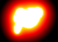



## Metaballs 2D

### Description

this code displays 2-dimensional gravitating metadiscs. you can choose between 3 different display modes.

also this code is an example for black/white-dithering

sorry, i haven't found an effective optimization yet
 
### More Info
 

             |
---                |---
**Submitted On**   |2005-10-04 04:10:02
**By**             |[amoxys](https://github.com/Planet-Source-Code/PSCIndex/blob/master/ByAuthor/amoxys.md)
**Level**          |Beginner
**User Rating**    |4.9 (79 globes from 16 users)
**Compatibility**  |VB 6\.0
**Category**       |[Graphics](https://github.com/Planet-Source-Code/PSCIndex/blob/master/ByCategory/graphics__1-46.md)
**World**          |[Visual Basic](https://github.com/Planet-Source-Code/PSCIndex/blob/master/ByWorld/visual-basic.md)
**Archive File**   |[Metaballs\_1937291042005\.zip](https://github.com/Planet-Source-Code/amoxys-metaballs-2d__1-62755/archive/master.zip)

